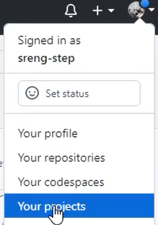
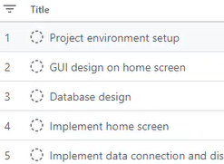
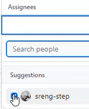

# Working8Registry
Learning to create and use Library and Hooks.
## Cloning project
1. Open Visual Studio
2. Click clone a repository
3. Search repository by name `Working8Registry`
4. Select repository `sreng-step/Working8Registry`
5. Select location to store solution files
6. Click clone.

## Creating and managing project in GitHub
1. Goto Github.com and login
2. Click on your avatar and select your projects 
3. Click new project  and then choose a template (table or board)
4. Rename the project name to "FT SD M11 Term project"
5. List tasks   and assign the tasks to your team members  
6. You can change the view (table or board)
7. Task statuses: 
   - To Do: It is ready to start
   - In progress: Doing or implementing the task by developer(s)
   - Done: The task is done or completed
8. You can add more status(es) if needed